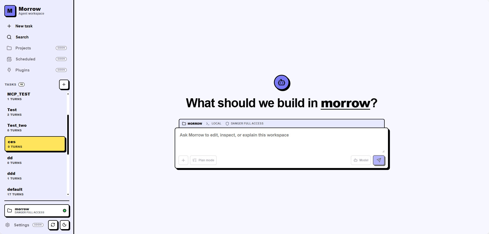

<div align="center">

# Morrow

**A local-first coding agent — CLI, interactive REPL, web dashboard, and desktop app, backed by any OpenAI-compatible API.**

[](https://github.com/catDforD/morrow/releases)
[](LICENSE)
[](Cargo.toml)

**English** · [简体中文](README.zh-CN.md)



</div>

Morrow streams model output, persists project-scoped sessions, reads and edits files, applies patches, runs shell commands behind explicit permissions, and can emit JSONL events for automation. Everything runs against your own OpenAI-compatible Chat Completions endpoint.

## Features

- **Three faces, one runtime** — CLI one-shots, an interactive REPL, a local browser dashboard, and a Tauri 2 desktop app.
- **Bring your own model** — OpenAI-compatible configuration via `--config`, local `morrow.toml`, or `~/.morrow/config.toml`; Web-only provider management with per-session model and reasoning selection.
- **Persistent sessions** — named, project-scoped sessions you can list, rename, export, and resume.
- **Real tools** — file reads, file edits, patch application, text search, directory listing, and shell commands.
- **Permission profiles** — read-only, workspace-write, and full-access modes, with shell execution controlled separately.
- **MCP support** — stdio and Streamable HTTP MCP servers, configured from TOML or the dashboard.
- **Read-only subagents** — delegate isolated workspace investigations and run independent tasks in parallel.
- **Long-session friendly** — automatic context compaction.
- **Scriptable** — JSONL event output for automation and integrations.

## Installation

### Desktop app (early access)

The Tauri 2 desktop app uses the same dashboard and local agent runtime as `morrow server`. It is a separate distribution and does not install the `morrow` CLI.

Download the installer for your machine from [GitHub Releases](https://github.com/catDforD/morrow/releases):

| Platform | Installer |
| --- | --- |
| Windows 10 22H2 / Windows 11 x64 | `Morrow_<version>_x64-setup.exe` |
| macOS 14+ (Apple Silicon) | `Morrow_<version>_aarch64.dmg` |
| macOS 14+ (Intel) | `Morrow_<version>_x64.dmg` |

These early builds are not formally code-signed or notarized. Download them only from the project GitHub Release page.

- **Windows** — run the NSIS installer. If SmartScreen blocks it, select **More info**, verify that the installer came from this repository's Release page, then select **Run anyway**.
- **macOS** — drag Morrow into Applications. For the first launch, right-click Morrow in Finder and choose **Open**. If it is still blocked, go to **System Settings → Privacy & Security** and choose **Open Anyway**.

The app restores the last valid workspace and offers **File → Open Folder** and **File → Open Recent**. Closing the window exits on Windows; on macOS it hides Morrow until it is reopened, while `Cmd+Q` exits.

Desktop updates are manual; the app does not check for updates in the background. Use **Help → Download Latest Version** or visit GitHub Releases, then run the newer Windows installer or replace the macOS app in Applications. Model settings, MCP settings, commands, and project sessions remain in `~/.morrow` across upgrades and normal uninstall operations. To downgrade, manually install an older GitHub Release; there is no in-app rollback.

### CLI

macOS and Linux:

```bash
curl -fsSL https://raw.githubusercontent.com/catDforD/morrow/main/install.sh | sh
morrow init
```

Install a specific release:

```bash
MORROW_VERSION=v0.1.0 curl -fsSL https://raw.githubusercontent.com/catDforD/morrow/main/install.sh | sh
```

Install to a custom directory:

```bash
MORROW_INSTALL_DIR=/usr/local/bin curl -fsSL https://raw.githubusercontent.com/catDforD/morrow/main/install.sh | sh
```

Windows users can download `morrow-x86_64-pc-windows-msvc.zip` from GitHub Releases, extract `morrow.exe` and `morrow-rg.exe` into the same directory, and put that directory on `PATH`.

Install from source:

```bash
cargo install --git https://github.com/catDforD/morrow --locked -p agent-cli
```

## Quick start

Run one prompt in the current project:

```bash
morrow "summarize this repository"
```

Start interactive mode:

```bash
morrow
```

Start the local web dashboard:

```bash
morrow server
```

The dashboard listens on `127.0.0.1:3000` by default and uses the current workspace, config, session store, and permission profile. It is local-first and unauthenticated; do not bind it to a public interface unless you add your own network protections. Customize the bind address with `morrow server --host 127.0.0.1 --port 3000`.

The dashboard selects permissions independently for each turn and remembers the latest browser choice. It defaults to `workspace_write`; `[permissions]` in `morrow.toml` applies to CLI runs only. The sidebar also supports archiving and restoring project-scoped task sessions.

## Configuration

Create a user config:

```bash
morrow init
```

This writes `~/.morrow/config.toml` and prompts for an API key. The generated file stores the key inline as `[model].OPENAI_API_KEY`, so treat it as private and do not commit it. Use `morrow init --template` to generate an editable template without entering a real key, and `morrow init --force` to overwrite an existing generated config.

Config lookup order:

1. Path passed with `--config`.
2. `morrow.toml` in the current working directory.
3. `~/.morrow/config.toml`.

Example config using an environment variable instead of an inline key:

```toml
[model]
base_url = "https://api.openai.com/v1"
model = "gpt-4.1"
api_key_env = "OPENAI_API_KEY"
timeout_secs = 120
context_window_tokens = 128000
reserved_output_tokens = 8192

[agent]
system_prompt = "You are a helpful assistant."

[context]
auto_compact = true
auto_compact_threshold = 0.835
retain_recent_turns = 6
summary_target_tokens = 12000
compact_max_retries = 2

[permissions]
mode = "read_only"
shell = "deny"
```

The inline `[model].OPENAI_API_KEY` value takes priority when present. Otherwise Morrow reads the environment variable named by `api_key_env`, which defaults to `OPENAI_API_KEY`.

CLI commands continue to require a valid model and API key in the resolved TOML config. `morrow server` is more permissive when `--config` is omitted: it can start without a config file, `[model]` section, or model API key so that the first provider can be configured in the browser. An explicitly requested missing config and invalid TOML still stop startup.

The dashboard's **Settings → Models** page manages Web-only OpenAI Chat Completions compatible providers. These settings do not change the CLI model. Provider data is stored in `~/.morrow/web-models.json`; API keys are kept as local plaintext, never returned by the API, and the file is written with mode `0600` on Unix. A valid TOML model appears as a read-only provider and becomes the initial Web default until another default is selected.

Every new turn persists its resolved model invocation in the shared runtime record. Live execution steps and restored session history therefore use the same model name across Web, CLI, Desktop, WSL, and remote workspaces.

The built-in DeepSeek template adds `deepseek-v4-flash` and `deepseek-v4-pro` with 1,000,000-token context windows, tool support, and **Off / High / Max** reasoning choices. New browser sessions inherit the global default, while each existing session remembers its own model and reasoning level.

### MCP tools

Morrow can register stdio and Streamable HTTP MCP servers from the same config file. Tools are exposed directly to the model as `mcp__server__tool` names after discovery. Initialized servers and discovered tools are cached for the CLI/server lifetime when their configuration has not changed.

```toml
[mcp_servers.filesystem]
command = "npx"
args = ["-y", "@modelcontextprotocol/server-filesystem", "."]
env = {}
cwd = "."
enabled = true
startup_timeout_sec = 10
tool_timeout_sec = 60
```

For a Streamable HTTP example with environment-backed headers, see [`morrow.example.toml`](morrow.example.toml). OAuth, deferred search, and per-tool approval policies are not implemented yet. MCP tools are treated as explicitly configured trusted tools, so review server commands and remote endpoints before enabling them.

The dashboard's **Settings → MCP Servers** page adds Web-only stdio and HTTP servers without changing the CLI configuration. Web entries are stored in `~/.morrow/web-mcp.json` and merged with read-only servers loaded from `morrow.toml`; duplicate names are rejected. Changes apply from the next Web turn, while a turn that is already running keeps its original server snapshot. The page can import direct JSON server maps or an `mcpServers` wrapper and can test a draft configuration without saving it.

Web MCP environment variables and HTTP header values are stored as local plaintext with mode `0600` on Unix. Their values are never returned by the settings API: leaving an existing value blank preserves it, while removing its row deletes it. Testing or using a configured MCP server may execute local programs or contact remote services.

### Read-only subagents

Models with tool support automatically receive a `delegate_task` tool for self-contained workspace investigations. A model can issue several `delegate_task` calls in one response to run independent research in parallel; the parent turn waits for the results before continuing.

Each subagent uses the currently selected model and reasoning level plus the configured system prompt, but starts with an isolated conversation containing only its delegated task. It can use `read_file`, `list_files`, and `search_text`; it cannot modify files, run shell commands, call MCP tools, or delegate another subagent.

A parent turn may start at most four subagents, with at most four running concurrently. Each task has a five-minute timeout and its returned report is capped at 12,000 characters. CLI, JSONL, Web, Desktop, and WSL surfaces expose subagent start/finish events. The parent session stores the delegated task and final tool result, not the subagent's full reasoning or internal transcript.

Each delegated call receives a display name from Morrow's built-in name pool. Names are unique within one parent turn, may be reused by later turns, and are persisted with the final tool result so live events and session history stay consistent. The dashboard keeps each subagent step collapsed by default; opening it reveals a fixed-height prompt/output card with independent scrolling. The output pane displays the final Markdown report after completion rather than streaming the subagent's internal transcript.

### Web custom commands

The dashboard's **Settings → Commands** page manages user commands in `~/.morrow/commands/*.md`. These commands are available only in Web chat; CLI and JSONL inputs keep their existing behavior. A command filename is its slash name and may contain lowercase ASCII letters, digits, `-`, and `_`.

```md
---
description: "Review a target file"
argument-hint: "<file-path>"
---
Review $ARGUMENTS carefully.
```

Type `/` in the Web composer to search commands. When `/review src/lib.rs` is sent, every `$ARGUMENTS` placeholder is replaced with `src/lib.rs`; if the template has no placeholder, the arguments are appended to the prompt. Unknown slash names are sent unchanged, and `//review` sends the literal text `/review`. The expanded prompt is what the model receives and what the session history stores.

## Permissions

CLI file access is controlled by `permissions.mode`:

| Mode | Behavior |
| --- | --- |
| `read_only` | Write tools are denied. |
| `workspace_write` | File changes require approval and are limited to the workspace. |
| `danger_full_access` | File reads and writes may access paths outside the workspace. |

Shell execution is controlled separately by `permissions.shell`:

| Mode | Behavior |
| --- | --- |
| `deny` | Shell commands are denied. |
| `prompt` | Shell commands require approval. |
| `allow` | Shell commands run without an approval prompt. |

The default `morrow init` config uses `read_only` and `shell = "deny"`.

Override permissions for a single run:

```bash
morrow --permission workspace-write "update the README"
morrow --allow-shell "run the test suite and explain failures"
```

## Sessions

Morrow stores project-scoped sessions under `~/.morrow/sessions/`. Use a named session to continue work across invocations:

```bash
morrow --session work "continue the refactor"
morrow --session work
```

Manage sessions:

```bash
morrow session list
morrow session show work
morrow session export work --output work-session.json
morrow session rename work backend-refactor
morrow session delete backend-refactor
```

Compatibility aliases `--thread` and `--reset-thread` are still accepted, but new usage should prefer `--session` and `--reset-session`.

Useful REPL commands:

```text
/status
/permissions read-only
/permissions workspace-write
/permissions danger-full-access
/compact
/reset
/exit
```

## Automation

For automation, emit one JSON object per event:

```bash
morrow --jsonl "inspect this crate" > events.jsonl
```

JSONL mode requires a prompt and is not available for interactive mode or session subcommands.

## Development

For the crate boundaries, dependency direction, turn lifecycle, extension points, and cancellation semantics, see [`ARCHITECTURE.md`](ARCHITECTURE.md).

Morrow is a Rust workspace:

| Crate | Responsibility |
| --- | --- |
| `crates/agent-cli` | CLI entry point, REPL, JSONL output, server command, and config wiring. |
| `crates/agent-desktop/src-tauri` | Tauri 2 desktop shell, native menus, project switching, and local server lifecycle. |
| `crates/agent-config` | `morrow.toml` and `~/.morrow/config.toml` loading. |
| `crates/agent-core` | Agent turn execution and event stream orchestration. |
| `crates/agent-model` | OpenAI-compatible HTTP client and streaming response parsing. |
| `crates/agent-protocol` | Shared protocol, session, permission, and event types. |
| `crates/agent-runtime` | Reusable runtime helpers for sessions, compaction, workspace detection, and turn execution. |
| `crates/agent-server` | Axum HTTP/WebSocket server and embedded dashboard assets. |
| `crates/agent-sandbox` | Permission evaluation. |
| `crates/agent-tools` | Built-in file and shell tools. |

Common Rust checks:

```bash
cargo build --workspace
cargo test --workspace
cargo fmt --check
cargo clippy --workspace --all-targets
```

Run from source:

```bash
cargo run -p agent-cli -- "hello"
cargo run -p agent-cli -- --session work "continue"
cargo run -p agent-cli -- server
```

### Web dashboard

```bash
cd crates/agent-server/web
pnpm install
pnpm dev
```

The Vite dev server listens on `127.0.0.1:5173` and proxies `/api` to `http://127.0.0.1:3000`, so run `cargo run -p agent-cli -- server` in another terminal.

Build dashboard assets for embedding in `agent-server`:

```bash
cd crates/agent-server/web
pnpm build
pnpm typecheck
```

### Desktop app

```bash
pnpm --dir crates/agent-server/web install
pnpm --dir crates/agent-desktop install
pnpm --dir crates/agent-desktop dev
```

Desktop development starts Vite at `127.0.0.1:5173`; the native shell starts its browser-mode Axum backend at `127.0.0.1:3000`. Keep port 3000 free. Release builds instead start an authenticated backend on a random loopback port and serve the embedded dashboard assets.

Native bundles must be built on their target operating system. Before native desktop development or a Windows/macOS bundle build, place the matching ripgrep binary in `crates/agent-desktop/src-tauri/binaries/` using Tauri's target-suffixed names:

```text
morrow-rg-x86_64-pc-windows-msvc.exe
morrow-rg-aarch64-apple-darwin
morrow-rg-x86_64-apple-darwin
```

Then build the target installer:

```bash
pnpm --dir crates/agent-desktop build:windows
pnpm --dir crates/agent-desktop build:macos
```

Release builds are created by tagging the exact workspace version, for example `v0.3.0`. GitHub Actions publishes the CLI archives, Windows NSIS installer, two architecture-specific macOS DMGs, and `SHA256SUMS` to one Release. No signing or updater secrets are required for this early-access workflow.

## Uninstall

Remove the CLI binary or uninstall/delete the desktop app. Local private state is intentionally retained; remove it separately only if desired:

```bash
rm -f ~/.local/bin/morrow
rm -rf ~/.morrow
```

## License

[MIT](LICENSE) © 2026 Gargantua
