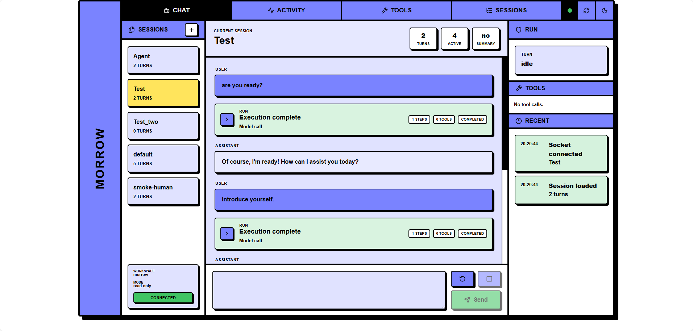

# Morrow

Morrow is a local coding agent CLI and web dashboard backed by an OpenAI-compatible Chat Completions API. It streams model output, persists project-scoped sessions, reads and edits files, applies patches, runs shell commands behind explicit permissions, and can emit JSONL events for automation.



## Highlights

- CLI, interactive REPL, and local browser dashboard.
- OpenAI-compatible model configuration through `--config`, local `morrow.toml`, or `~/.morrow/config.toml`.
- Persistent named sessions scoped to the current project.
- Built-in tools for file reads, file edits, patch application, text search, directory listing, and shell commands.
- Read-only, workspace-write, and full-access permission profiles, with shell execution controlled separately.
- Automatic context compaction for long sessions.
- JSONL event output for scripts and integrations.

## Install

macOS and Linux:

```bash
curl -fsSL https://raw.githubusercontent.com/catDforD/morrow/main/install.sh | sh
morrow init
```

Install a specific release:

```bash
MORROW_VERSION=v0.1.0 curl -fsSL https://raw.githubusercontent.com/catDforD/morrow/main/install.sh | sh
```

Install to a custom directory:

```bash
MORROW_INSTALL_DIR=/usr/local/bin curl -fsSL https://raw.githubusercontent.com/catDforD/morrow/main/install.sh | sh
```

Windows users can download `morrow-x86_64-pc-windows-msvc.zip` from GitHub Releases, extract `morrow.exe` and `morrow-rg.exe` into the same directory, and put that directory on `PATH`.

Install from source:

```bash
cargo install --git https://github.com/catDforD/morrow --locked -p agent-cli
```

## Configure

Create a user config:

```bash
morrow init
```

This writes `~/.morrow/config.toml` and prompts for an API key. The generated file stores the key inline as `[model].OPENAI_API_KEY`, so treat it as private and do not commit it.

Generate an editable template without entering a real key:

```bash
morrow init --template
```

Overwrite an existing generated config:

```bash
morrow init --force
```

Config lookup order:

1. Path passed with `--config`.
2. `morrow.toml` in the current working directory.
3. `~/.morrow/config.toml`.

Example config using an environment variable instead of an inline key:

```toml
[model]
base_url = "https://api.openai.com/v1"
model = "gpt-4.1"
api_key_env = "OPENAI_API_KEY"
timeout_secs = 120
context_window_tokens = 128000
reserved_output_tokens = 8192

[agent]
system_prompt = "You are a helpful assistant."

[context]
auto_compact = true
auto_compact_threshold = 0.835
retain_recent_turns = 6
summary_target_tokens = 12000
compact_max_retries = 2

[permissions]
mode = "read_only"
shell = "deny"
```

The inline `[model].OPENAI_API_KEY` value takes priority when present. Otherwise Morrow reads the environment variable named by `api_key_env`, which defaults to `OPENAI_API_KEY`.

### MCP stdio tools

Morrow can register stdio MCP servers from the same config file. Tools are exposed directly to the model as `mcp__server__tool` names after Morrow starts the server and calls `tools/list`.

```toml
[mcp_servers.filesystem]
command = "npx"
args = ["-y", "@modelcontextprotocol/server-filesystem", "."]
env = {}
cwd = "."
enabled = true
startup_timeout_sec = 10
tool_timeout_sec = 60
```

MCP support is intentionally narrow in v1: only stdio servers are supported. HTTP, OAuth, deferred search, persistent process pools, and per-tool approval policies are not implemented yet. MCP tools are treated as explicitly configured trusted tools, so review server commands before enabling them.

## Run

Run one prompt in the current project:

```bash
morrow "summarize this repository"
```

Start interactive mode:

```bash
morrow
```

Start the local web dashboard:

```bash
morrow server
```

The dashboard listens on `127.0.0.1:3000` by default. It uses the current workspace, config, session store, and permission profile. It is local-first and unauthenticated; do not bind it to a public interface unless you add your own network protections.

Customize the dashboard bind address:

```bash
morrow server --host 127.0.0.1 --port 3000
```

The browser UI can approve or deny prompted shell and file actions, but it cannot raise permissions beyond the mode used when the server started.

## Permissions

File access is controlled by `permissions.mode`:

- `read_only`: write tools are denied.
- `workspace_write`: file changes require approval and are limited to the workspace.
- `danger_full_access`: file reads and writes may access paths outside the workspace.

Shell execution is controlled separately by `permissions.shell`:

- `deny`: shell commands are denied.
- `prompt`: shell commands require approval.
- `allow`: shell commands run without an approval prompt.

The default `morrow init` config uses `read_only` and `shell = "deny"`.

Override permissions for a single run:

```bash
morrow --permission workspace-write "update the README"
morrow --allow-shell "run the test suite and explain failures"
```

## Sessions

Morrow stores project-scoped sessions under `~/.morrow/sessions/`. Use a named session to continue work across invocations:

```bash
morrow --session work "continue the refactor"
morrow --session work
```

Manage sessions:

```bash
morrow session list
morrow session show work
morrow session export work --output work-session.json
morrow session rename work backend-refactor
morrow session delete backend-refactor
```

Compatibility aliases `--thread` and `--reset-thread` are still accepted, but new usage should prefer `--session` and `--reset-session`.

Useful REPL commands:

```text
/status
/permissions read-only
/permissions workspace-write
/permissions danger-full-access
/compact
/reset
/exit
```

## Automation

For automation, emit one JSON object per event:

```bash
morrow --jsonl "inspect this crate" > events.jsonl
```

JSONL mode requires a prompt and is not available for interactive mode or session subcommands.

## Development

Morrow is a Rust workspace:

- `crates/agent-cli`: CLI entry point, REPL, JSONL output, server command, and config wiring.
- `crates/agent-config`: `morrow.toml` and `~/.morrow/config.toml` loading.
- `crates/agent-core`: agent turn execution and event stream orchestration.
- `crates/agent-model`: OpenAI-compatible HTTP client and streaming response parsing.
- `crates/agent-protocol`: shared protocol, session, permission, and event types.
- `crates/agent-runtime`: reusable runtime helpers for sessions, compaction, workspace detection, and turn execution.
- `crates/agent-server`: Axum HTTP/WebSocket server and embedded dashboard assets.
- `crates/agent-sandbox`: permission evaluation.
- `crates/agent-tools`: built-in file and shell tools.

Common Rust checks:

```bash
cargo build --workspace
cargo test --workspace
cargo fmt --check
cargo clippy --workspace --all-targets
```

Run from source:

```bash
cargo run -p agent-cli -- "hello"
cargo run -p agent-cli -- --session work "continue"
cargo run -p agent-cli -- server
```

Develop the web dashboard:

```bash
cd crates/agent-server/web
pnpm install
pnpm dev
```

The Vite dev server listens on `127.0.0.1:5173` and proxies `/api` to `http://127.0.0.1:3000`, so run `cargo run -p agent-cli -- server` in another terminal.

Build dashboard assets for embedding in `agent-server`:

```bash
cd crates/agent-server/web
pnpm build
pnpm typecheck
```

Release builds are created by tagging `v*` and letting GitHub Actions publish the platform archives plus `SHA256SUMS`.

## Uninstall

Remove the binary and, if desired, local private state:

```bash
rm -f ~/.local/bin/morrow
rm -rf ~/.morrow
```
