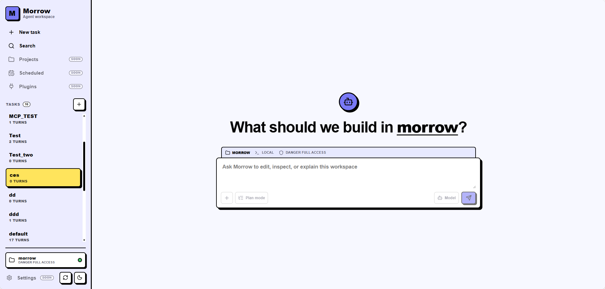

<div align="center">

# Morrow

**本地优先的编码 Agent —— 集 CLI、交互式 REPL、Web 仪表盘和桌面应用于一体，兼容任意 OpenAI 风格 API。**

[](https://github.com/catDforD/morrow/releases)
[](LICENSE)
[](Cargo.toml)

[English](README.md) · **简体中文**



</div>

Morrow 以流式方式输出模型结果，按项目持久化会话，可以读写文件、应用补丁、在明确授权下执行 shell 命令，并能输出 JSONL 事件用于自动化。所有能力都运行在你自己的 OpenAI 兼容 Chat Completions 端点上。

## 功能特性

- **一个运行时，多种形态** —— CLI 单次执行、交互式 REPL、本地浏览器仪表盘，以及 Tauri 2 桌面应用。
- **自带模型** —— 通过 `--config`、本地 `morrow.toml` 或 `~/.morrow/config.toml` 配置 OpenAI 兼容模型；Web 端可独立管理服务商，并按会话选择模型与推理档位。
- **持久化会话** —— 按项目划分的命名会话，支持列表、重命名、导出和续接。
- **真实工具** —— 文件读写、补丁、搜索、目录列举与 shell 命令。
- **权限档案** —— 只读、工作区写入、完全访问；shell 单独控制。
- **策略 Hook** —— 在 `before_prompt`、`before_tool`、`permission_request`、`after_tool`、`after_turn` 与压缩前后运行受信命令 Hook；项目 Hook 需要显式 `morrow hooks trust` 后才生效。
- **MCP 支持** —— 通过 TOML 或仪表盘配置 stdio 与 Streamable HTTP MCP 服务器。
- **会话级 Subagent** —— 在后台运行持久化的 `explore`、`plan`、`worker`、`reviewer` 实例，并可在 Web/Desktop 中查看、继续、取消或删除。
- **长会话友好** —— 自动上下文压缩。
- **可脚本化** —— JSONL 事件输出，便于自动化与集成。

## 安装

### 桌面应用（早期体验）

Tauri 2 桌面应用与 `morrow server` 共用同一套仪表盘和本地 Agent 运行时，但不会安装 `morrow` CLI。

从 [GitHub Releases](https://github.com/catDforD/morrow/releases) 下载对应平台的安装包：

| 平台 | 安装包 |
| --- | --- |
| Windows 10 22H2 / Windows 11 x64 | `Morrow_<version>_x64-setup.exe` |
| macOS 14+（Apple Silicon） | `Morrow_<version>_aarch64.dmg` |
| macOS 14+（Intel） | `Morrow_<version>_x64.dmg` |

早期构建未做正式签名与公证，请只从本项目的 GitHub Release 页面下载。Windows 若被 SmartScreen 拦截，确认来源后选择 **仍要运行**；macOS 首次启动可在 Finder 中右键 **打开**，或在 **系统设置 → 隐私与安全性** 中允许。

应用会恢复最近一次工作区，并提供 **File → Open Folder** / **Open Recent**。更新需手动进行（**Help → Download Latest Version** 或访问 Releases）。模型、MCP、命令与会话等数据保留在 `~/.morrow`。

### CLI

macOS 和 Linux：

```bash
curl -fsSL https://raw.githubusercontent.com/catDforD/morrow/main/install.sh | sh
morrow init
```

安装指定版本或自定义目录：

```bash
MORROW_VERSION=v0.3.1 curl -fsSL https://raw.githubusercontent.com/catDforD/morrow/main/install.sh | sh
MORROW_INSTALL_DIR=/usr/local/bin curl -fsSL https://raw.githubusercontent.com/catDforD/morrow/main/install.sh | sh
```

Windows 可从 GitHub Releases 下载 `morrow-x86_64-pc-windows-msvc.zip`，将 `morrow.exe` 与 `morrow-rg.exe` 解压到同一目录并加入 `PATH`。

从源码安装：

```bash
cargo install --git https://github.com/catDforD/morrow --locked -p agent-cli
```

## 快速上手

```bash
morrow "summarize this repository"   # 单次提示
morrow                               # 交互模式
morrow server                        # 本地 Web 仪表盘
```

仪表盘默认监听 `127.0.0.1:3000`，使用当前工作区、配置、会话与权限。它是本地优先且无鉴权的，不要绑定到公网。可用 `morrow server --host 127.0.0.1 --port 3000` 自定义地址。

仪表盘按 turn 独立选择权限（默认 `workspace_write`，并记住浏览器端最近一次选择）；`morrow.toml` 中的 `[permissions]` 仅作用于 CLI。

## 配置

```bash
morrow init
```

写入 `~/.morrow/config.toml` 并提示输入 API key。生成的 key 以内联方式保存在配置中，请勿提交。可用 `morrow init --template` 生成不含真实 key 的模板，或 `morrow init --force` 覆盖已有配置。

配置查找顺序：`--config` → 当前目录 `morrow.toml` → `~/.morrow/config.toml`。

```toml
[model]
base_url = "https://api.openai.com/v1"
model = "gpt-4.1"
api_key_env = "OPENAI_API_KEY"
timeout_secs = 120
context_window_tokens = 128000
reserved_output_tokens = 8192

[agent]
system_prompt = "You are a helpful assistant."

[context]
auto_compact = true
auto_compact_threshold = 0.835
retain_recent_turns = 6
summary_target_tokens = 12000
compact_max_retries = 2

[permissions]
mode = "read_only"
shell = "deny"
```

内联的 `[model].OPENAI_API_KEY` 优先；否则读取 `api_key_env`（默认 `OPENAI_API_KEY`）。CLI 需要有效的模型与 API key；未传 `--config` 时，`morrow server` 即使没有配置也能启动，以便在浏览器中配置第一个服务商。

Web 端的模型、MCP 服务器、自定义命令与 Subagent 设置分别在 **Settings → Models / MCP Servers / Commands / Subagents** 中管理，数据保存在 `~/.morrow/` 下，不影响 CLI 的 TOML 配置。更多示例见 [`morrow.example.toml`](morrow.example.toml)。

### 项目指令

工作区启动时，Morrow 会读取已解析工作区根目录下的 `AGENTS.md`，并将其追加到 `[agent].system_prompt`。同一份快照会应用于主 Agent、临时委派 Agent 和持久 Subagent。运行时角色限制与权限校验仍然优先，`AGENTS.md` 不能授予额外的工具访问权限。

只加载根目录的 `AGENTS.md`。文件必须是普通 UTF-8 文件且不超过 32 KiB；不会跟随符号链接，也不会查找嵌套文件或备用文件名。文件缺失或为空时直接忽略；读取失败会在启动终端及 **设置 → 关于** 中显示告警，同时继续使用基础 system prompt。

文件修改会在下次启动 CLI/server，或重新打开桌面/WSL 工作区时生效。其内容会作为 system prompt 的一部分发送给所配置的模型，因此不要在 `AGENTS.md` 中保存密钥等敏感信息。

### MCP 工具

可在配置中注册 stdio 与 Streamable HTTP MCP 服务器，发现后的工具以 `mcp__server__tool` 形式暴露给模型：

```toml
[mcp_servers.filesystem]
command = "npx"
args = ["-y", "@modelcontextprotocol/server-filesystem", "."]
env = {}
cwd = "."
enabled = true
startup_timeout_sec = 10
tool_timeout_sec = 60
```

MCP 工具视为显式配置的受信工具，启用前请检查服务器命令与远程端点。

### 策略 Hook

命令 Hook 在上述生命周期边界执行。用户级配置位于 `~/.morrow/hooks.toml`，项目级配置位于 `<workspace>/.morrow/hooks.toml`。项目 Hook 默认禁用：只有对该精确配置执行 `morrow hooks trust`（按 SHA-256 指纹信任）后才生效，`morrow hooks revoke` 可撤销。Hook 以当前用户权限执行，请像审查 shell 命令一样审查后再信任。可用 `morrow hooks list | trust | revoke` 管理。

`after_turn` Hook 在模型自称完成、turn 被接受之前执行。它收到最终文本与 turn 摘要（`final_text`、`tool_call_count`、`turn_message_count`、`tool_names`），返回 `{"decision": "complete" | "continue" | "fail"}`：`continue` 把 `additional_context` 注入对话并再跑一轮模型（每 turn 最多 3 次，超限强制完成并发出警告），`fail` 以给定理由判负该 turn。例如一个 turn 结束前跑测试的验收门：

```toml
[[hooks]]
id = "verify-tests"
event = "after_turn"
command = ["/bin/sh", "-c", "cargo test --workspace >/dev/null 2>&1 && printf '%s' '{\"decision\":\"complete\"}' || printf '%s' '{\"decision\":\"continue\",\"additional_context\":[\"cargo test 仍为红色；先修复再结束\"]}'"]
```

### Subagent

Web/Desktop 会话通过 `spawn_subagent`、`send_subagent`、`inspect_subagent`、`wait_subagents` 和 `cancel_subagent` 管理可后台运行的持久 Subagent。父 turn 结束后子任务仍可继续。用户可以在 Subagents 检查器中查看完整消息与事件日志、使用保留的上下文继续空闲或中断实例、取消活跃任务，或删除终态实例。

| 角色 | 内置工具 | 权限上限 |
| --- | --- | --- |
| `explore` | 读取、列目录、搜索 | 只读；禁止 shell |
| `plan` | 读取、列目录、搜索 | 只读；禁止 shell |
| `worker` | 文件读写、补丁、shell | 工作区写入；shell 始终审批 |
| `reviewer` | 读取、列目录、搜索、shell | 不提供文件写工具；每条 shell 都审批 |

有效权限取父权限、角色上限、显式工具 allowlist 与 `[tools] allow/deny` 过滤的交集；权限不足的工具不会出现在模型请求中。Subagent 不会获得 MCP 或继续委派的工具。Subagent run 无人值守执行，因此其工作区内写入始终自动放行，不受 `workspace_write_require_approval` 影响。每个角色可覆盖模型/推理级别、追加最多 4,000 字符的提示词、设置 30–1,800 秒超时和 1–99 个工具轮次。设置变更只影响新实例；实例创建时会快照身份名称、有效提示词、模型与权限上限。

每个会话最多保留 8 个持久实例，同时最多执行 4 个 Subagent run。父智能体的文件写入与 shell、`worker` run、获批的 `reviewer` shell 共用一个 workspace writer lease；读取仍可并行。父子审批请求进入同一个 FIFO 队列并显示来源。文件修改获批后会在真正写入前重新验证预览，工作区已变化时旧审批会被拒绝。

持久实例保存在 `~/.morrow/subagent-sessions/<workspace-scope>/<session>/`。事件日志达到 16 MiB 后停止保存流式 delta，但继续保存消息、工具、审批和终态事件。应用重启时，排队中、运行中和等待审批的 run 会转为 `interrupted`，旧审批与锁被清除，未完成操作绝不会自动重放。远程模型凭据仅在创建或继续任务时临时传输并驻留内存，不会写入实例 sidecar。

兼容工具 `delegate_task({task})` 仍保持同步、严格只读：它创建临时 `explore`，随父 turn 取消，且不占持久实例容量。CLI 目前只提供该兼容工具；持久生命周期控制面向 Web/Desktop 和远程 workspace。姓名与头像仍在 **Settings → Subagents** 中独立管理（`~/.morrow/subagents.json`）。

### Web 自定义命令

**Settings → Commands** 管理 `~/.morrow/commands/*.md` 中的斜杠命令（仅 Web 可用）。在输入框键入 `/` 可搜索；`$ARGUMENTS` 会被替换为传入参数。

## 权限

| `permissions.mode` | 行为 |
| --- | --- |
| `read_only` | 拒绝写入类工具 |
| `workspace_write` | 文件修改限制在工作区内并自动放行（可用下文 `workspace_write_require_approval` 恢复逐次审批） |
| `danger_full_access` | 可访问工作区外路径 |

| `permissions.shell` | 行为 |
| --- | --- |
| `deny` | 拒绝 shell |
| `prompt` | shell 需批准 |
| `allow` | shell 直接执行 |

Shell 策略是 Agent 层的审批边界，不是 OS 级只读沙箱。获批命令会继承 Morrow 进程用户的操作系统权限，命令本身仍可能修改文件；批准前应检查命令，需要更强隔离时请配合外部沙箱。

`workspace_write` 模式下，解析到工作区内的写入自动放行——只有 shell 命令、越界写入（直接拒绝）和非只读 MCP 工具仍需审批。如需恢复旧的逐次确认行为：

```toml
[permissions]
workspace_write_require_approval = true
```

默认配置为 `read_only` + `shell = "deny"`。单次运行可覆盖：

```bash
morrow --permission workspace-write "update the README"
morrow --allow-shell "run the test suite and explain failures"
```

## 会话

会话按项目保存在 `~/.morrow/sessions/`：

```bash
morrow --session work "continue the refactor"
morrow session list
morrow session show work
morrow session export work --output work-session.json
morrow session rename work backend-refactor
morrow session delete backend-refactor
```

REPL 常用命令：`/status`、`/permissions ...`、`/compact`、`/reset`、`/exit`。兼容别名 `--thread` / `--reset-thread` 仍可用，新用法请优先 `--session` / `--reset-session`。

## 自动化

```bash
morrow --jsonl "inspect this crate" > events.jsonl
```

JSONL 模式要求提供提示词，不可用于交互模式或 session 子命令。

## 开发

crate 边界、turn 生命周期与扩展点见 [`ARCHITECTURE.md`](ARCHITECTURE.md)。

<p align="center">
  
</p>

| Crate | 职责 |
| --- | --- |
| `agent-cli` | CLI、REPL、JSONL、`session`/`hooks` 子命令与服务装配 |
| `agent-desktop` | Tauri 2 桌面外壳、嵌入式 server 生命周期、WSL |
| `agent-config` | 配置加载 |
| `agent-core` | Turn 执行、端口、中间件与事件流 |
| `agent-eval` | Agent 循环确定性回归套件 |
| `agent-hooks` | 命令 Hook 与中间件适配器 |
| `agent-model` | OpenAI 兼容客户端与流式解析 |
| `agent-protocol` | 共享协议类型 |
| `agent-remote` | Desktop/WSL 远程协议与转发 |
| `agent-runtime` | 会话、压缩、工作区与 turn 辅助 |
| `agent-server` | HTTP/WebSocket 与内嵌仪表盘 |
| `agent-sandbox` | 权限判定 |
| `agent-tools` | 内置文件与 shell 工具 |

```bash
cargo build --workspace
cargo test --workspace
cargo fmt --check
cargo clippy --workspace --all-targets -- -D warnings
cargo run -p agent-eval -- run   # agent 循环回归套件

cargo run -p agent-cli -- "hello"
cargo run -p agent-cli -- server
```

Web 前端开发：

```bash
cd crates/agent-server/web && pnpm install && pnpm dev
# 另开终端：cargo run -p agent-cli -- server
```

桌面开发：

```bash
pnpm --dir crates/agent-server/web install
pnpm --dir crates/agent-desktop install
pnpm --dir crates/agent-desktop dev
```

原生安装包需在目标 OS 上构建，并将匹配的 ripgrep 二进制放入 `crates/agent-desktop/src-tauri/binaries/` 后执行 `pnpm --dir crates/agent-desktop build:windows` 或 `build:macos`。打与 workspace 版本一致的 tag（如 `v0.3.1`）会触发 GitHub Actions 发布 CLI 与桌面安装包。

## 卸载

删除 CLI 二进制或卸载桌面应用即可。本地数据会有意保留：

```bash
rm -f ~/.local/bin/morrow
rm -rf ~/.morrow
```

## 许可证

[MIT](LICENSE) © 2026 Gargantua
